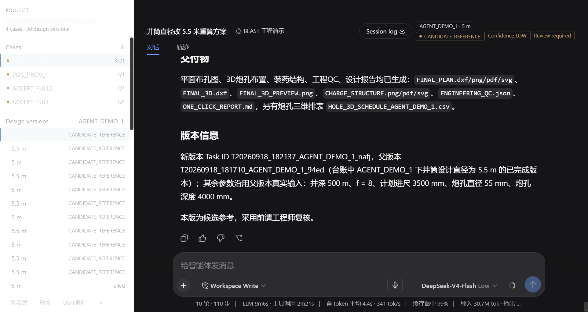
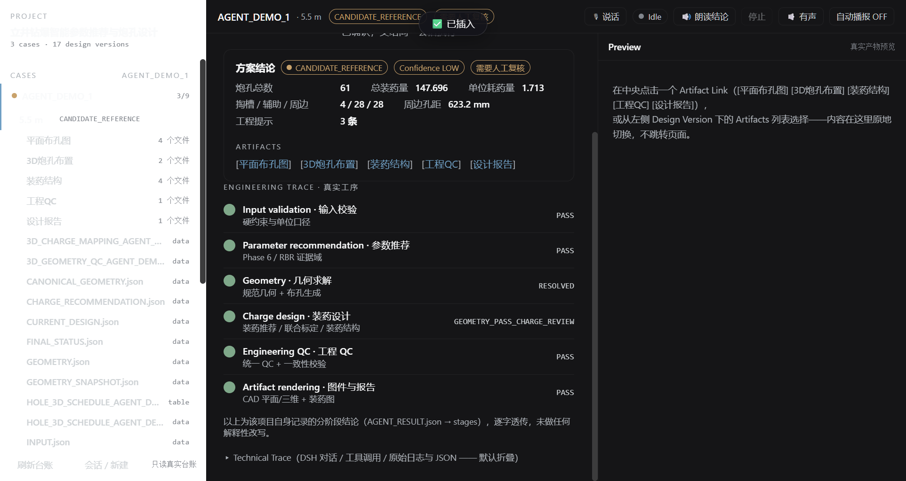
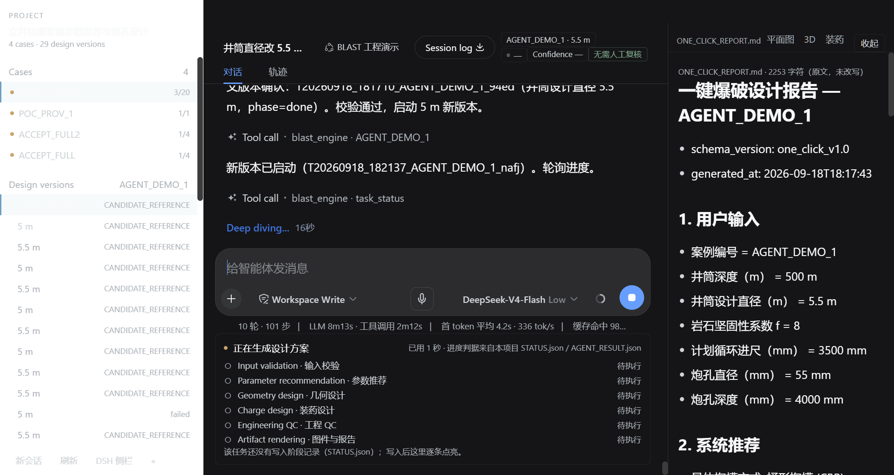
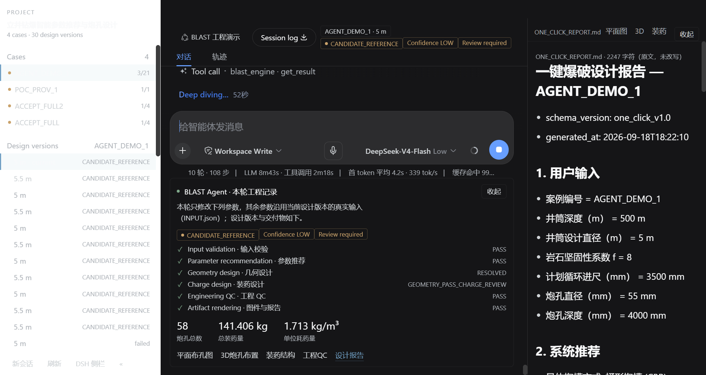
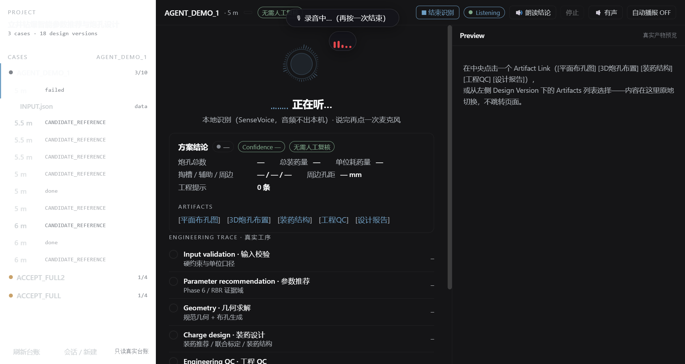
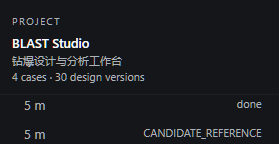

# BLAST Studio · MiningAgent

**立井钻爆设计系统的工程智能体工作区**（公开源码版）。
把一个确定性的钻爆设计流水线，包装成「会对话、会出图、会被工程师审阅」的工作台：
左侧是工程案例台账，中间是与智能体的原生对话，右侧是真实交付物预览——**所有工程数值都来自
项目自己的计算，界面不做任何估算**。

本仓库是 **UI 与接口层**的公开源码（`release/blast-studio`）：

| 组件 | 内容 | 版本 |
|---|---|---|
| `blast_engineering_ui/` | **BLAST Studio** —— Conversation-Native 工程工作区（DeepSeek Harness 客户端插件） | `0.4.0-conversation-native` |
| `agent_adapter/` | **Agent 适配层** —— 11 个只搬运/整形、不计算的工具 + JSON 信封 + 结果契约 + 工具目录 | `1.0.0` |
| `docs/` | 结果契约、适配层说明、公开版审计与精选真机截图 | — |



> **关于范围（请先读这一段）**
> 本次公开的是**工程智能体的界面与接口**。确定性的核心流水线（钻爆参数推荐 → 几何求解 →
> 布孔 → 装药结构 → 联合校准 → 工程 QC → CAD 图纸 → 报告）、训练好的模型、历史案例证据库
> 与项目级 Skill **不在本仓库**。因此：
> * `agent_adapter` 的**只读**工具在缺少核心流水线时依然可以导入、可以 `--help`、可以给出结构化错误；
> * **会产生新计算**的工具（`run-analysis`）需要核心流水线存在才能算出结果——`doctor` 会明确报告
>   `core51_present = false`，而不是给出任何占位数值。
> 详见 [`PUBLIC_RELEASE_AUDIT.md`](PUBLIC_RELEASE_AUDIT.md)。

---

## 1. 它解决什么问题

钻爆设计是典型的「数值要能追溯、结论要经人审」的场景。直接让 LLM 从零生成孔网参数不可接受，
因此本工作区的做法是：

1. **算法与智能体彻底分离**。计算只发生在项目自己的流水线里（`51_one_click_end_to_end`，
   约 45–180 s 一次完整方案）；智能体只能调用工具、读真实产物、组织语言。
2. **界面只做投影**。浏览器端不做乘除、不插值、不四舍五入，只渲染服务端返回的字段；
   每个字段都带 provenance（`canonical 路径 ← Core 文件:JSON 路径`）。
3. **参数变更是一道闸门**，不是一次悄悄的重算。改井径、改循环进尺会先出结构化 Diff
   （`shaft_diameter_m 5 m → 5.5 m`），工程师点 `Cancel` 或 `Create version` 之后才可能触发计算。
4. **低置信度必须显式可见**。方案卡上常驻 `CANDIDATE_REFERENCE` / `Confidence LOW` /
   `Review required` 徽章——**候选参考，采用前请工程师复核**。

---

## 2. 架构

```
┌────────────────────────────── BLAST Studio (DSH 客户端插件) ──────────────────────────────┐
│  Context Sidebar        │  DSH 原生 Conversation（主角）      │  Preview Pane            │
│  PROJECT / CASES        │  用户气泡 / 助手回答 / Think 折叠卡  │  设计报告(渲染)          │
│  DESIGN VERSIONS        │  工具卡 / 审批 / 计划审阅 / 语音     │  平面布孔图 / 3D / 装药   │
│  THREADS · HISTORY      │  ↓ 每轮末尾追加「本轮工程记录」      │  工程 QC —— 原地切换      │
│  ARTIFACTS              │  ↓ 原生 Composer：文字 + 语音 + 闸门 │  （不跳页、可下载）       │
└──────────┬───────────────────────────┬─────────────────────────────┬────────────────────┘
           │ (1) 只读扫描             │ (2) HTTP /blast-engineering-api │
           ▼                          ▼                             ▼
   blast_engineering_ui/lib/case-store.mjs  ── 台账扫描 / 缓存 / artifact 白名单
           │
           │ (3) spawn，cwd = repo 根，PYTHONPATH = repo 根
           ▼
   python -m agent_adapter.cli <tool>        ── 单 JSON 信封 stdout（诊断只进 stderr）
           │
           ▼
   51_one_click_end_to_end（确定性核心，未公开）── 真实计算与真实产物
```

* 浏览器半 `lib/client.js` **就是产物**（无打包步骤），只注册 7 个官方扩展席位，**不注册任何浮层**，
  也不修改 DSH 任何 Core 文件；
* Node 半 `lib/host.mjs` 只注册一个前缀路由 `/blast-engineering-api`；
* 一切「能算」的能力都在 Python 侧 `agent_adapter/`，它**不含任何工程算法**。

### 2.1 工程 Trace（界面里的真实工序）

每一次方案生成都会在界面上留下一条可核对的工序链，判定结果**逐字来自该项目自己的
`STATUS.json` / `AGENT_RESULT.json`**，界面不做解释性改写：



`Input validation → Parameter recommendation → Geometry → Charge design → Engineering QC →
Artifact rendering`，任一阶段非 PASS 都在界面上原样呈现（例如
`GEOMETRY_PASS_CHARGE_REVIEW`、`RESOLVED`）。

### 2.2 执行中与完成后的两种形态

| 执行中：6 步 Trace 逐条点亮 + 原生「Deep diving」 | 完成后：本轮工程记录 + 指标 + 交付物链接 |
|---|---|
|  |  |

长任务（45–180 s）走**后台模式 + 轮询**：`run-analysis` 立即返回 `task_id`，
`task-status` 轮询相位，界面按 `STATUS.json` 的真实阶段记录点亮步骤，不需要把长任务塞进一次工具调用等待。

### 2.3 语音：一种输入模式，不是一个新界面

语音走「本地识别 → 草稿回读 → 人工确认」：麦克风只把文字放进 Composer，
**识别结果不会自动发送、更不会自动触发计算**；说错就改，改完仍要过参数变更闸门。



* 音频不出本机（SenseVoice 本地识别）；
* 朗读结论（TTS）可以被下一句话打断；
* 语音只影响「输入」这一件事：界面结构、数据来源与安全闸门完全不变。

---

## 3. `agent_adapter/` —— 11 个工具，一个信封

```powershell
# 推荐入口（内部固定 .venv 解释器 + PYTHONPATH，不依赖 PATH 里的 python）
agent_adapter\blast.cmd <子命令> [参数...]

# 等价写法（工作目录 = 仓库根）
.\.venv\Scripts\python.exe -m agent_adapter.cli <子命令> [参数...]
```

**契约**：stdout 永远是**一个 JSON 对象**（`--out <file>` 可另存）；诊断信息一律进 stderr / 日志；
退出码 `0` 成功、`3` 输入被硬约束阻止、`1` 其它失败。

| 子命令 | 作用 | 是否重算 |
|---|---|---|
| `doctor` | 环境自检（Python、numpy/matplotlib/ezdxf、核心入口、workspace 可写） | 否 |
| `validate-input` | 校验并标准化 7 个必填工程参数，返回缺失项与 Core 原生错误 | 否 |
| `run-analysis` | 调用生产流水线生成完整方案（**唯一重算入口**；默认后台） | **是** |
| `task-status` | 后台任务的相位与耗时 | 否 |
| `get-result` | 只读读取真实结果（任务或历史冻结案例）`summary/package/explain/单文件` | 否 |
| `canonical-result` | Canonical Result Contract：Agent 的唯一标准解释（字段带 provenance） | 否 |
| `validate-result-consistency` | 一致性校验：孔数守恒、质量平衡、状态-标记自洽、产物存在… | 否（且从不修改结果） |
| `list-tasks` | 最近任务列表（自然语言指代「刚才那个」的消歧） | 否 |
| `compare-results` | 两个真实方案的输入/指标字段级差异（`delta = b - a`） | 否 |
| `generate-figures` | 用既有快照 + 冻结渲染器重新出图（PNG/PDF/SVG/DXF） | 否 |
| `generate-report` | 用该任务保存的真实结果生成 10 章节中文报告 | 否 |

工具目录（含每个工具的输入/输出字段）以机器可读形式定义在
[`agent_adapter/schemas/tool_catalog.json`](agent_adapter/schemas/tool_catalog.json)，
可被 Skill 或后续 MCP server 复用。

### 3.1 结果契约（Result Contract）

`canonical-result` 是本项目的**唯一标准解释层**：把 Core 的产物整理成固定字段、标注每个字段的
provenance（`canonical 路径 ← Core 文件:JSON 路径`），并把两个容易混淆的概念**分列两侧**：

* OOD（是否超出适用范围）与 置信度（模型自身的确定性）**分开**；
* 「需要人工复核」与 「系统判定」**分开**；
* 第一屏给结论与关键指标，`--section explain` 才给完整决策追溯。

字段字典见 [`docs/RESULT_CONTRACT.md`](docs/RESULT_CONTRACT.md)。

### 3.2 数据纪律（硬规则，不可绕过）

1. 输出里的工程数值**不得被智能体改写、插值或估算**——只允许搬运与组织语言；
2. 图件与报告必须来自 `generate-figures` / `generate-report` 产生的**真实文件**，
   禁止让模型画图、禁止伪造报告；
3. 历史冻结案例（核心流水线的 `outputs/`）**只读**：不重算、不覆盖；
4. 浏览器端**不做任何计算**，只渲染服务端字段；
5. 低置信度、OOD、复核状态必须在界面上**显式可见**（徽章常驻，不折叠成脚注）。

> **`CANDIDATE_REFERENCE` 免责声明**
> 系统输出的是**候选参考方案**，不是可直接施工的设计文件。工程数值仅来自本项目流水线在
> 给定输入下的计算，其适用性受输入条件、地质参数与模型适用域限制；正式采用前必须由
> 持证工程技术人员复核，并与现场实测、规范与安全规程校核。仓库作者不对任何工程后果负责。

---

## 4. 快速开始

### 4.1 环境

| 需求 | 说明 |
|---|---|
| Python | ≥ 3.10（开发环境为 3.12）；适配层依赖 numpy / matplotlib / ezdxf（`torch` 可选，缺失时装药 ML 路径自动降级为统计路径） |
| Node.js | ≥ 22（插件声明 `engines.node >= 22`） |
| 宿主 | DeepSeek Harness（DSH Desktop）。插件是 DSH 客户端插件，**不是**独立网页应用 |
| 核心流水线 | **公开版不包含**；没有它也能安装插件、跑 `doctor`，但无法算出新方案 |

```powershell
# 1) 适配层自检（不需要核心流水线也能看到结构化结论）
agent_adapter\blast.cmd doctor

# 2) 校验一组输入参数（不触发计算）
agent_adapter\blast.cmd validate-input --input-json '{"case_id":"DEMO","shaft_depth_m":500,"shaft_diameter_m":5.5,"protodyakonov_f":8,"planned_advance_mm":3500,"borehole_diameter_mm":55,"borehole_depth_mm":4000}'

# 3) 后台生成一版方案（需要核心流水线）
agent_adapter\blast.cmd run-analysis --input-file request.json
agent_adapter\blast.cmd task-status --task-id <task_id>
agent_adapter\blast.cmd canonical-result --task-id <task_id>
```

### 4.2 安装 BLAST Studio 插件（DSH Desktop）

插件包根目录是 `blast_engineering_ui/`，安装方式是「包挂载 + profile patch 一行」，
**不改任何 DSH 安装目录内的文件**：

```powershell
# 1) 把插件目录挂进 profile 的 node_modules（junction，只影响本机用户目录）
cmd /c mklink /J "%USERPROFILE%\.dsh\profiles\desktop\node_modules\blast-engineering-ui" "<repo-root>\blast_engineering_ui"

# 2) 在该 profile 的用户 patch 层插入一行（顶层必须是 YAML 数组）
#    %USERPROFILE%\.dsh\profiles\desktop\cordis.patch.yml
- insert:
    - id: blast-engineering-ui
      name: 'blast-engineering-ui'

# 3) 重启 DSH Desktop（profile 组合只在启动时读取；client bundle 改动无需重启）
```

回滚同样是一步：删掉 junction + 还原 patch 文件 + 重启，DSH 即回到出厂 UI。

### 4.3 可选：最小权限 Demo Profile

`blast_engineering_ui/demo-profile/` 提供一份**最小权限**的 Agent Profile（只允许
`agent_adapter\blast.cmd run-analysis` 与 `.venv\Scripts\python.exe -m agent_adapter.cli …`，
拒绝串联语句、重定向、管道、任意 cmdlet、外来 python）。安装：

```powershell
node blast_engineering_ui\tools\install-demo-profile.mjs
```

它只写入用户级 `DSH_HOME`（默认 `~/.dsh`），提供 `dsh.agent-presets` 默认 preset 与一条
「BLAST Studio」host 行。

### 4.4 离线自检（不需要 DSH、不需要 LLM）

```powershell
node blast_engineering_ui\tools\client-contract-test.mjs   # 席位/浮层/渲染契约（纯离线）
node blast_engineering_ui\tools\host-contract-test.mjs     # Cordis 装配 + HTTP 契约（需台账）
node blast_engineering_ui\tools\selftest.mjs               # 数据层（需台账 + 核心 CLI）
node blast_engineering_ui\tools\serve.mjs --port 4180      # 单独跑 API，便于 curl 调试
```

---

## 5. 配置（环境变量）

路径全部**仓库相对**解析（`agent_adapter/config.py` 用 `Path(__file__).parent.parent`，
UI 用 `BLAST_ENGINEERING_UI_REPO` 或插件目录上溯），因此可以整体移动/克隆到任意目录。
只有下面这些开关需要环境变量：

| 变量 | 作用 | 默认 |
|---|---|---|
| `BLAST_AGENT_WORKSPACE` | 适配层运行区（任务台账 / 日志 / provenance） | `agent_adapter/workspace` |
| `BLAST_AGENT_PYTHON` | 计算用解释器 | 当前解释器 |
| `BLAST_AGENT_TIMEOUT_S` | 前台单次流水线最长等待（后台模式不受此限制） | `3600` |
| `BLAST_AGENT_USE_ML` | 装药推荐是否优先 ML 混合路径 | `1` |
| `BLAST_AGENT_USE_6E` | 是否启用 Model6E（生产路径一律关闭） | `0` |
| `BLAST_AGENT_POLL_INTERVAL_S` | 后台轮询建议间隔 | `10` |
| `BLAST_AGENT_LIST_LIMIT` | `list-tasks` 默认条数 | `20` |
| `BLAST_AGENT_SINGLE_PROCESS` | 单进程/单线程数值库（消除线程级浮点抖动，换取可复现） | `0`（关闭） |
| `BLAST_AGENT_ORIGIN` / `_DETAIL` | 调用来源标记，写入 runtime provenance | `direct` |
| `BLAST_ENGINEERING_UI_REPO` | 插件解析仓库根（不设则按插件目录上溯） | — |
| `DSH_HOME` | DSH 用户目录（Demo Profile 安装目标） | `~/.dsh` |

`runtime_provenance.jsonl` 记录的是「真正算数值的那个进程自己看到的环境」，不是调用方自称传了什么——
用于回答「声明的运行条件是否真的到达了计算进程」。

---

## 6. 文档索引

| 文档 | 内容 |
|---|---|
| [`PUBLIC_RELEASE_AUDIT.md`](PUBLIC_RELEASE_AUDIT.md) | **公开版审计**：收录/排除清单、脱敏规则与逐文件计数、截图出处、复现扫描的命令 |
| [`docs/RESULT_CONTRACT.md`](docs/RESULT_CONTRACT.md) | 结果契约：字段字典、OOD/复核两侧分离、provenance 规范 |
| [`agent_adapter/README.md`](agent_adapter/README.md) | 适配层说明：工具、信封、Skill 接线、目录结构 |
| [`blast_engineering_ui/README.md`](blast_engineering_ui/README.md) | 插件说明：三栏结构、7 个官方席位、安装/回滚、验证工具 |
| [`blast_engineering_ui/docs/CONVERSATION_NATIVE_UI_REDESIGN.md`](blast_engineering_ui/docs/CONVERSATION_NATIVE_UI_REDESIGN.md) | 本轮 UI 交付报告：席位地图、复用点、折叠行为、DSH Core 影响=无、验收与限制 |
| `blast_engineering_ui/docs/VOICE_POC_IMPLEMENTATION.md` / `VOICE_RUNTIME_AUDIT.md` | 语音 POC 实现与运行时审计 |
| `blast_engineering_ui/docs/DEMO_PROFILE.md` | 最小权限 Demo Profile 的机制结论、安装与回滚 |
| `blast_engineering_ui/docs/POC_ROUND1.md` / `VOICE_FIRST_WORKSPACE_POC.md` | 第一/二轮交付报告（历史） |

> 这些文档原为内部交付 / 真机验收记录，发布时已剥离主机名、用户名与绝对路径；
> 正文中形如 `docs/screenshots/**` 的图片属内部验收图集，未随公开版发布，
> 公开版只保留 `docs/assets/` 下的精选图集（见审计文档）。



---

## 7. 已知限制

1. **不是一个独立可运行的产品**：没有确定性核心流水线时，只能体验界面、契约与只读工具；
   `run-analysis` / `generate-*` 无法产出新结果。
2. **工程数值不可外推**：数值只对「给定输入 + 该版本流水线」成立；输入变化必须重新跑一次真实计算。
3. **界面是第一屏优先**：第一屏不含绝对路径、Task ID、raw JSON、token 统计；这些信息在
   Technical Trace 折叠区或 CLI 信封里。
4. **变更闸门挂在 Composer 卡片底缘**：受 DSH 会话渲染链限制，闸门可能延迟到下一次无关重渲染才刷新
   （详见 `CONVERSATION_NATIVE_UI_REDESIGN.md` §10）。
5. **没有自定义对话节点类型**：工程记录卡挂在 `turnTail`（该轮末尾）链路，而不是注册新的会话事件类型。
6. **真机验收需要人工兜底**：DSH Desktop 冷启动可能停在官方「选择一个工作区」主视觉，验收脚本失败时需人工选一次。
7. **深色主题是设计要求**：插件按深色界面设计（本机 `ui-theme.preference` 已置为 `dark`）。

---

## 8. 许可证与免责

* 本仓库代码以 **MIT** 许可发布，见 [`LICENSE`](LICENSE)。
* 仓库内的工程截图来自本项目的真实运行（案例名、参数与指标均为真实产物），仅用于展示界面形态，
  **不构成任何工程结论**。
* 再次强调：**系统输出为候选参考（`CANDIDATE_REFERENCE`），采用前请工程师复核。**

---

<sub>仓库说明：本仓库原为占位 README（“MiningAgent you know”）。本次 `release/blast-studio`
发布用上述内容替换了该占位文案，历史提交仍可在 `main` 分支查看。</sub>
