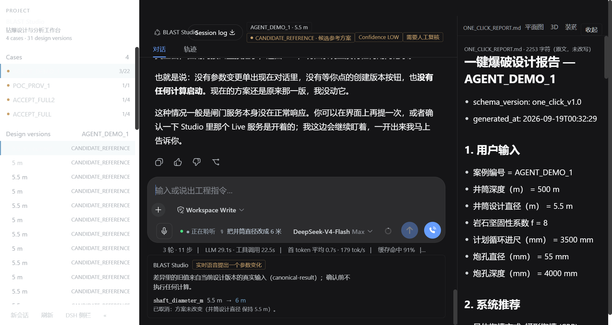

# blast-live-voice —— BLAST Studio 的正式 Live Voice（Qwen Audio Realtime Plus）

> 正式集成日期：2026-09-19 ｜ 环境：Windows ｜ DSH Desktop 2.0.3（harness 0.1.1-rc.2）
> 结论：**Live Voice 已从独立 POC 页面（127.0.0.1:3080）合并进正式 BLAST Studio**；
> 用户入口只有 BLAST Studio 一个。**DSH Core / app.asar / 生产流水线 / 冻结目录零改动。**

## 它是什么

实时语音（Qwen Audio Realtime Plus，全双工、连续对话、可随时插话）只是 BLAST Studio 的
**新增输入方式**，不是第二套工程系统：

```
文字 ─┐
语音（SenseVoice 单次，本地）─┼─► 同一个 Conversation / Case / Design Version
Qwen Live Voice（连续实时）──┘    同一个 Parameter Diff 闸门 / 同一个 Engineering Core / 同一个 Preview
```

实时语音模型**没有任何直接改变工程方案的路径**：说话提出的参数变更只能变成一条
**Parameter Diff**（旧值来自当前设计版本的真实输入 `canonical-result`），
只有人点【创建版本】才会启动真实计算；在那之前 `task_id` 为空。

## 装了什么（最小 diff）

| 项 | 位置 | 说明 |
|---|---|---|
| 实时语音 provider | `@harness-remote/dsh-realtime-voice@0.1.0-alpha.9`（第三方，未改动） | 已在 POC 人工验收；Composer 右侧 📞、连续对话、barge-in、DSH 交接 |
| 本包（product 层） | `blast_live_voice/` | 闸门状态机 + 设计读取 + 适配层调用 + `/permit/check`（人在环许可） |
| Studio 客户端 | `blast_engineering_ui/lib/client.js` | Composer 旁的轻量 Live 状态 + 对话内 Parameter Diff 闸门（同一个座位，不加页面） |
| 执行互锁 | `blast_engineering_ui/lib/blast-tools.mjs` | Live 通话活跃时 `run_analysis` 必须持有人工确认的 permit，否则 fail-closed |
| 会话 preset | `blast-demo`（`blast_engineering_ui/demo-profile/`） | 加一行 `blast-live-voice/agent-tools`（只有读设计/开闸门，没有执行面） |

部署只写 DSH home：`profiles/node_modules` 的 junction + `profiles/<profile>/cordis.patch.yml`
里一段**带标记**的托管块（旧文件先备份）。**不改 DSH Core、不改 `desktop profile` 的其它行。**

## 一键操作

```powershell
# 1) 合入正式 profile（默认 desktop；profile id 的唯一来源是 lib/studio.mjs）
node blast_live_voice\scripts\deploy-studio-live.mjs --install
node blast_engineering_ui\tools\install-demo-profile.mjs --install     # 刷新 blast-demo（含 Live 闸门工具行）

# 2) 冷启动 BLAST Studio 并自检（-Exe 或环境变量 DSH_DESKTOP_EXE 指向 DSH Desktop.exe）
powershell -File blast_live_voice\scripts\start-studio.ps1 -Restart
powershell -File blast_live_voice\scripts\start-studio.ps1 -Restart -Cdp   # 附带 CDP（自动化验收用）

# 3) 机器可验证的 Live Voice 生产验收（真渲染进程）
node blast_live_voice\scripts\probe-studio-live.mjs --timeout 60000

# 4) 回滚（只撤本包；实时 provider 的 junction 见脚本输出）
node blast_live_voice\scripts\deploy-studio-live.mjs --uninstall
node blast_engineering_ui\tools\install-demo-profile.mjs --install
```

## Live Transcript（实时字幕）

* **用户当前语音**：在 Composer 那一行里以**单行省略**字幕实时显示（`🎙 …`），interim 也显示；
* **Agent 当前语音**：同一行切换为 `🔊 …` 流式显示；
* **final transcript → 正常 User Message**：用户说完（provider 离开 `listening` 相位）后，
  这一句话会作为**普通用户消息**写入当前 Conversation（走原生 Composer 的 draft + submit，
  与会话里手打一模一样）；
* 若 provider 已经为这句话做了 handoff（它的 user message 里带 `<spoken_input>` 原文），
  我们**不重复写**——它会记录在 hosts 侧 `runtime/transcripts.jsonl`（`reason=already-in-conversation(handoff)`）；
* **字幕没有执行权限**：字幕路径里没有闸门请求、没有 `run_analysis`、没有 `blast_engine`；
  参数修改仍然只能由人工在 Parameter Diff 上点【创建版本】触发（契约测试对此有负向断言）。

来源与边界（如实）：provider 的转写面（它自己的通话卡片，被本插件用 CSS 收起但仍在渲染）
是我们**只读**的文本来源，靠它自己的 `aria-label` 与 class 后缀（`userText` / `assistantText`）定位；
相位用它的通话控件（通话中会自称「结束实时语音」）。provider 一行未改。



## 状态显示（只在 Composer 附近，不占界面）

| 相位（provider 自己发布） | 显示 |
|---|---|
| `requesting-permission` / `connecting` / `reconnecting` | 正在连接… |
| `listening`（含用户说话、barge-in 之后） | ● 正在聆听 |
| `thinking` / `agent-working` / `speaking` | BLAST Studio 正在回应 |
| `idle` | 不显示（Composer 恢复「输入或说出工程指令…」） |

provider 自己的**展开浮层**被本插件用 CSS 收起（`[aria-label="实时语音通话"]`）：Live Voice
默认不占用工作区，对话内容本来就在原生会话里。它的小悬浮球保留，麦克风静音/结束通话仍可用。

## 凭据（严守纪律）

`DASHSCOPE_API_KEY` 只来自：进程环境变量 / 用户环境变量 / **DSH 凭据库**
（`ctx.credentials.resolve()`，即「设置 → 插件 → DSH 实时语音」保存的那份）。
本包**不写**任何 key：不进源码、不进 Git、不进 yaml 明文、不进 localStorage、不进日志、不进截图。

## 目录

| 路径 | 说明 |
|---|---|
| `lib/host.mjs` | host 面入口（bundle 行）：挂路由，不预绑定工作区、不自带页面 |
| `lib/routes.mjs` | `/live` `/state` `/design` `/gate/*` `/permit/check` `/voice/presence` |
| `lib/gate.mjs` | Parameter Diff / Action Gate 状态机（与 POC 同一实现 + 人在环许可） |
| `lib/design.mjs` / `lib/adapter.mjs` | 真实设计读取 / 固定 argv 调用 adapter CLI（与 POC 同一实现） |
| `lib/agent-tools.mjs` | agent 面：`blast_live_design_read` / `blast_live_gate_request` / `blast_live_gate_status` |
| `lib/studio.mjs` | **profile id / preset id / 端口 / 路径的唯一来源**（冷启动修复） |
| `lib/config.mjs` | 参数契约、指标标签、Live 相位词汇 |
| `scripts/deploy-studio-live.mjs` | 最小 diff 合入 / 撤回 |
| `scripts/start-studio.ps1` | 冷启动 + 自检（profile id 从 `lib/studio.mjs` 读，不手写） |
| `scripts/probe-studio-live.mjs` | 生产验收（CDP，真渲染进程） |
| `scripts/cdp-eval.mjs` | 渲染进程调试工具（Desktop 只服务自己的渲染进程，故必须这样调） |
| `docs/LIVE_VOICE_INTEGRATION.md` | 集成设计：复用了什么、加了什么、为什么 |
| `docs/LIVE_VOICE_PRODUCTION_ACCEPTANCE.md` | 验收矩阵（机器项 + 必须人工的项）与证据 |

## 已知限制（如实）

1. **DSH Desktop 只服务自己的渲染进程**（`dsh-plugin-desktop/DesktopWebServer.permits`）：
   裸 loopback HTTP 一律 403。因此（a）对插件路由的任何调试/验收必须在渲染进程里做
   （`scripts/cdp-eval.mjs`），（b）Live 通话在场状态由渲染进程上报到本包的
   `/voice/presence`，agent 面的互锁读 `<repo>/blast_live_voice/runtime/voice.json`。
2. **`conversation.composer.dock` 只在会话开始后存在**：空白新会话（hero）里看不到工程闸门；
   正式流程是「打开现有工程会话 → 点 📞」（见验收文档）。
3. provider 的展开浮层被收起（设计选择，见上）；若需要它的原生气泡，删掉 `client.js`
   里 `CSS_LIVE` 的那一条规则即可。
4. 实时 provider 的 junction 指向 `blast_live_poc/vendor/repo-inspect/package`（POC 审计过的同一份包）；
   若要脱离 POC 目录，改用 `dsh plugin --profile desktop add @harness-remote/dsh-realtime-voice`。
